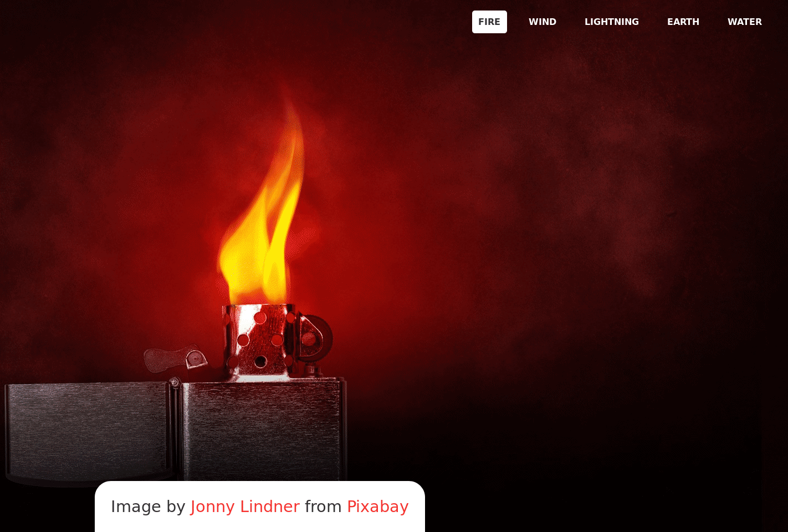

# Background Switcher
It uses features like `resource preloading`, where images are preloaded to avoid their inavailabilty when need arises.

It also features `data attributes` for code flexibity

Thanks to the creator of images for providing photos for free and are credited in the project page

