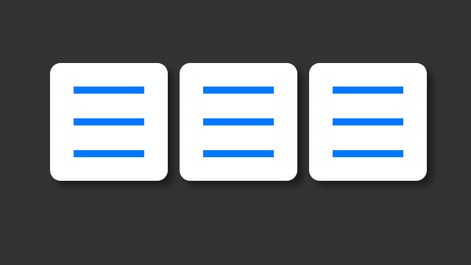

# Hamburger Button
Expand menu icon that truns into a X

Minimum width is considered

Only a block capable element with a class of `ham-btn` is required and edit css files

**Note:** only minimum of width and height of a `.ham-btn` is considered as dimension so as to keep it a square.

